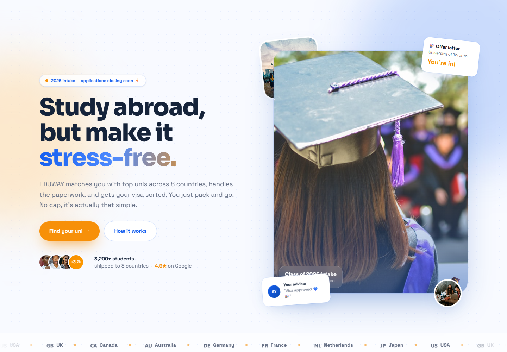
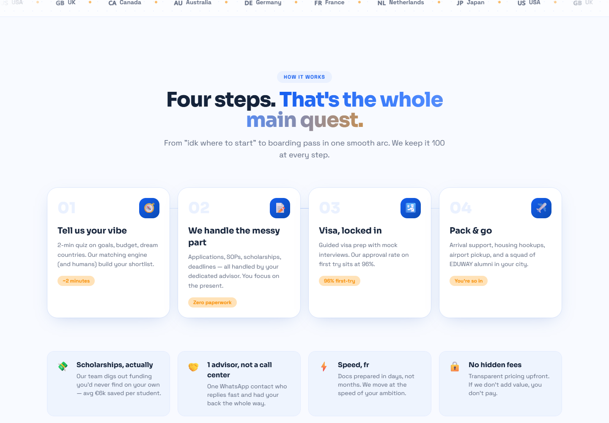
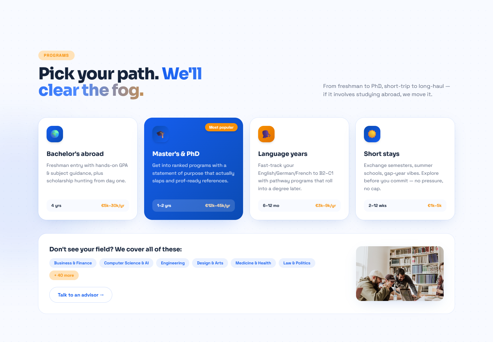
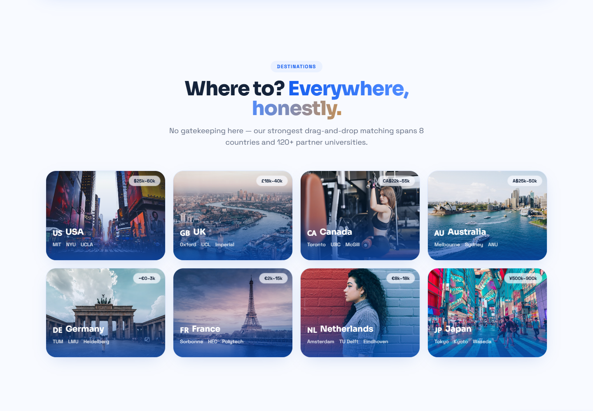
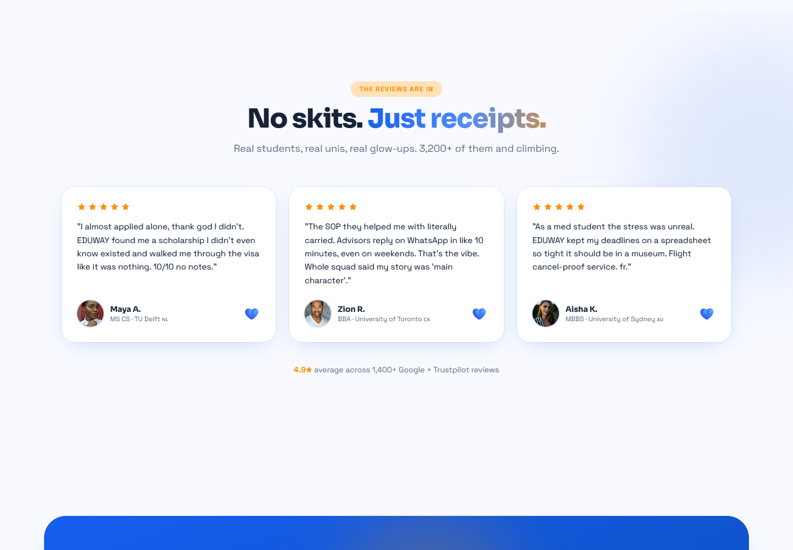
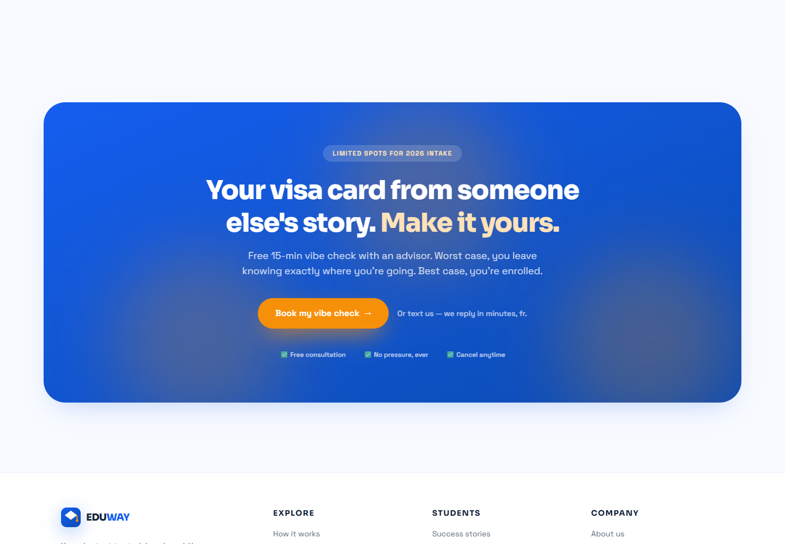

# EDUWAY

Study abroad, but make it stress-free. Landing page for a fictional study-abroad agency for students who want universities, visas and scholarships handled without the chaos. Built as a portfolio piece.

React, Vite, Tailwind CSS v4, and Motion (framer-motion) for the animations. The palette comes from the EDUWAY brand system.

Live site: **https://eduway-theta.vercel.app/**

## Screenshots













## Run it

```sh
npm install
npm run dev
```

Build for production with `npm run build` (`dist/`), preview with `npm run preview`.

## Structure

- `src/App.tsx` — assembles the page and hosts the global touches (scroll progress, custom cursor, back-to-top).
- `src/components/` — one component per section (Nav, Hero, HowItWorks, Programs, Stats, Destinations, Testimonials, CTA, Footer) plus the bits that make it move (Reveal, Counter, ScrollProgress, BackToTop, CustomCursor).
- `src/components/Logo.tsx` — the EDUWAY mark (gradient mortarboard + orange tassel), used in the nav, footer and favicon.
- `public/images/` — all photography served locally (Unsplash); nothing is hotlinked, so images work offline and never 404.
- `src/index.css` — the design tokens in `@theme` plus the keyframes (float, marquee, blob, wiggle, glow).

## Palette

Defined once in `@theme` and referenced everywhere. No stray hex values.

| Role | Hex |
|---|---|
| Primary | `#155EEF` |
| Secondary | `#0B4BB3` |
| Background | `#F8FAFF` |
| Surface | `#EAF1FF` |
| Text | `#15233A` |
| Muted text | `#667085` |
| Accent | `#F79009` |
| Accent light | `#FFE2B8` |

## Known rough edges

- The CTAs are front-end only — "Book my vibe check" opens a mail link; there's no backend behind the form.
- Section reveals are handled by `Reveal.tsx`, which combines IntersectionObserver with a scroll-listener fallback so content is never left hidden if the observer is unavailable.
- Screenshots are desktop viewport grabs of each section; the mobile layout intentionally stacks to two columns.